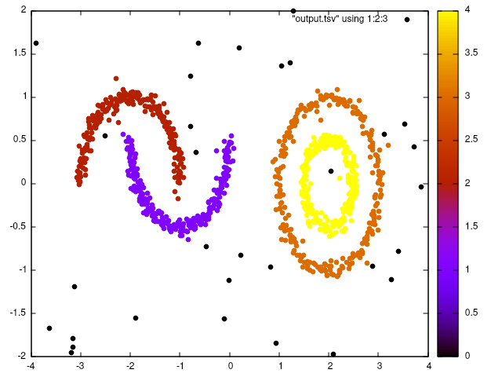
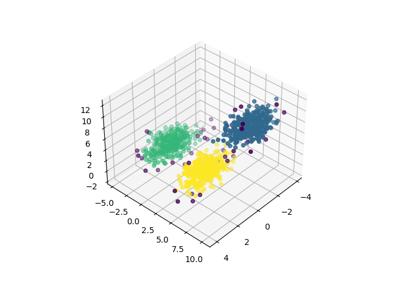

# Density-based spatial clustering of applications with noise (DBSCAN)

This is a fast C++ implementation of dbscan clustering algorithm.

Compiling and running the example:

```bash
g++ example.cpp dbscan.cpp -I vendor/ -std=c++20 -o example
./example sample2d.csv 0.2 10 > output.csv
```

<p align="center">
  
</p>

Or run with three dimensional data:
```
./example sample3d.csv 1 10 > output.csv
```

<p align="center">
  
</p>