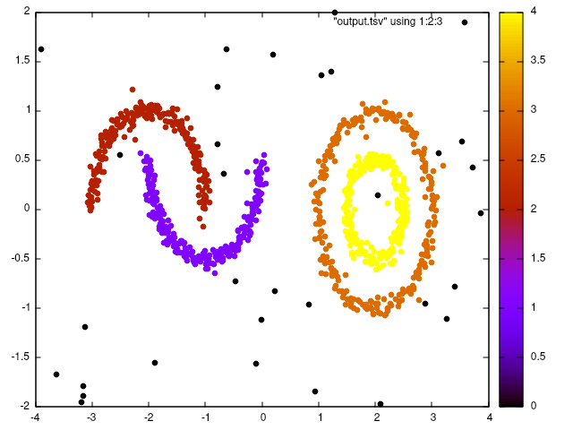

# Density-based spatial clustering of applications with noise (DBSCAN)

This is a fast C++ implementation of dbscan clustering algorithm.

Compiling and running the example:

```bash
g++ example.cpp dbscan.cpp -I vendor/ -o example
./example example.csv 0.2 10 > output.csv
```

And you can use gnuplot to viualize the result.

```
gnuplot> set datafile separator ','
gnuplot> plot "output.csv" using 1:2:3 with points pt 7 palett
gnuplot>
```
<p align="center">
  
</p>